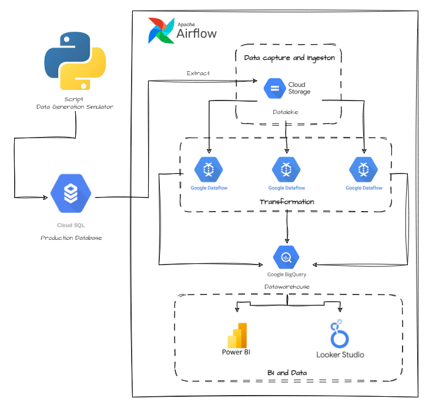

# Building-A-Batch-Pipeline-With-Airflow
Welcome to a project showcase that takes you through the journey of building a scalable batch pipeline on Airflow and Google Cloud Platform (GCP) using Apache Beam, Python, Dataflow, Google Cloud Storage (GCS), and BigQuery. In this project, we present a comprehensive overview of a real-world project that demonstrates the power of Apache Beam in automating data extraction, transformation, and loading processes.

Batch pipelines are pivotal in modern data processing, allowing businesses to efficiently analyze vast amounts of data. My project showcases the seamless integration of Apache Beam as a powerful data processing framework with Python, enabling parallel and scalable batch processing on GCP. We’ll guide you through the setup of the project environment, data extraction from various sources, the utilization of Apache Beam for data processing, and the loading of results into BigQuery for analysis.

# Description Project
The goal of our project is to simulate an existing cloud database hosted on PostgreSQL. To achieve this, I have a dataset after I split it to each tables. Including customer information, product details, orders, and location. Our aim is to automate this data generation process to run daily and inject the data into Cloud PostgreSQL. Because limit budget storage data in Google Cloud SQL PostgreSQL, I only automate this process for order data.

The purpose of our project extends beyond data generation. We utilize various components to extract, process, and analyze the data in a scalable and efficient manner. We start by retrieving data from the PostgreSQL database and storing it in Google Cloud Storage (GCS). The data is then processed using Apache Beam, a powerful data processing framework, within Google Dataflow. Finally, the processed data is injected into BigQuery for further analysis.

The components used in our project include Python for data generation, PostgreSQL for the source database, Apache Beam and Google Dataflow for data processing, GCS for intermediate storage, BigQuery for data analysis and storage, and finally, automation is achieved through the use of Airflow.

With this comprehensive setup, we demonstrate the end-to-end process of migrating an existing database to the cloud, automating data generation, processing, and analysis. Through the integration of these powerful components, we enable efficient data handling and derive meaningful insights from the migrated database.

Below a simple illustration of the overall process of this project :

# Folder Structure
* airflow: Contain all script to build airflow pipeline and setup airflow docker system.
* data_generation_simulator: Contain all script and requirement to run automate data generation process for order data.
* google_sql: Contain script to create tables in Google SQL PostgreDB.

# Setup and configuration 