# Building-A-Batch-Pipeline-With-Airflow
Welcome to a project showcase that takes you through the journey of building a scalable batch pipeline on Airflow and Google Cloud Platform (GCP) using Apache Beam, Python, Dataflow, Google Cloud Storage (GCS), and BigQuery. In this project, we present a comprehensive overview of a real-world project that demonstrates the power of Apache Beam in automating data extraction, transformation, and loading processes.

Batch pipelines are pivotal in modern data processing, allowing businesses to efficiently analyze vast amounts of data. My project showcases the seamless integration of Apache Beam as a powerful data processing framework with Python, enabling parallel and scalable batch processing on GCP. We’ll guide you through the setup of the project environment, data extraction from various sources, the utilization of Apache Beam for data processing, and the loading of results into BigQuery for analysis.

# Description Project
The goal of our project is to simulate an existing cloud database hosted on PostgreSQL. To achieve this, I have a dataset after I split it to each tables. Including customer information, product details, orders, and location. Our aim is to automate this data generation process to run daily and inject the data into Cloud PostgreSQL. Because limit budget storage data in Google Cloud SQL PostgreSQL, I only automate this process for order data.

The purpose of our project extends beyond data generation. We utilize various components to extract, process, and analyze the data in a scalable and efficient manner. We start by retrieving data from the PostgreSQL database and storing it in Google Cloud Storage (GCS). The data is then processed using Apache Beam, a powerful data processing framework, within Google Dataflow. Finally, the processed data is injected into BigQuery for further analysis.

The components used in our project include Python for data generation, PostgreSQL for the source database, Apache Beam and Google Dataflow for data processing, GCS for intermediate storage, BigQuery for data analysis and storage, and finally, automation is achieved through the use of Airflow.

With this comprehensive setup, we demonstrate the end-to-end process of migrating an existing database to the cloud, automating data generation, processing, and analysis. Through the integration of these powerful components, we enable efficient data handling and derive meaningful insights from the migrated database.

Below a simple illustration of the overall process of this project :
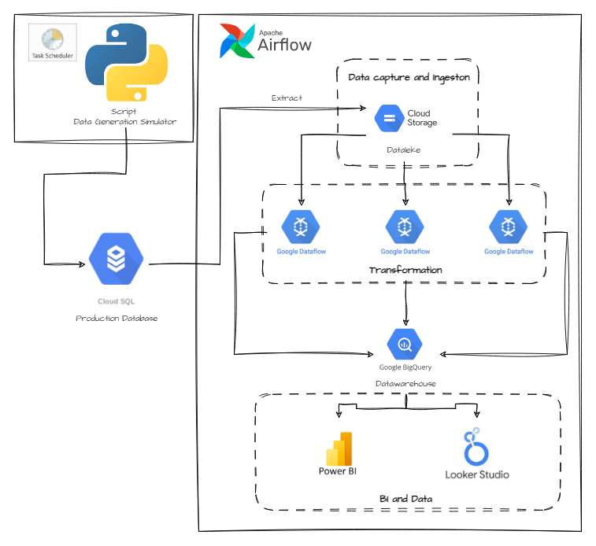

# Folder Structure
* airflow: Contain all script to build airflow pipeline and setup airflow docker system.
* data_generation_simulator: Contain all script and requirement to run automate data generation process for order data.
* dataset: Contain dataset file to import database and for automation order data generation
* google_sql: Contain script to create tables in Google SQL PostgreDB.

# Setup and configuration
1) Google Cloud Platform (GCP) Account: Create a GCP account and set up a project to access the required services get the json file (airflow/key_admin_service_account_connection.json) for the service account as well since it will allow the authentifications. Enable Google Cloud Service APIs, Google Cloud Storage APIs, Google Cloud Dataflow APIs and Google Cloud Bigquery APIs to build pipeline in project. 
2) Python: Install Python on your local machine, preferably the latest version, along with the necessary packages in requirements.txt.
3) PostgreSQL: Set up a PostgreSQL instance on Google Cloud SQL.
4) Google Cloud Storage (GCS): Set up a GCS bucket to store intermediate data during the pipeline execution. Ensure you have the necessary permissions and access credentials.
5) Google BigQuery: Create a BigQuery dataset and tables to store the processed data. Configure the necessary permissions and ensure you have the credentials to interact with BigQuery.
6) Airflow: Set up Apache Airflow on Docker to automate the data generation, processing, and loading pipeline. Install and configure Airflow according to your requirements, including defining the necessary DAGs and scheduling tasks, in this project we used airflow on a docker container.
7) Google Cloud SDK: Configured with appropriate permissions

# Guide 
## Setup Google Cloud SQL
### Setup Environment
Access Google SQL on GCP and create a instance. You can choose any your database engine. In this project, I choose PostgreSQL.
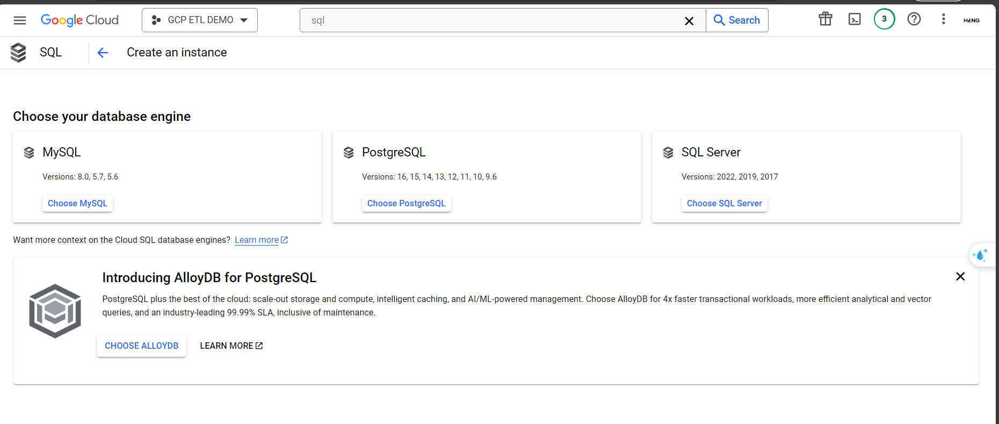

After instance set up successfully, We access the instance and create a new database. Example, I created **pd-database** instance and create **db_app** database.
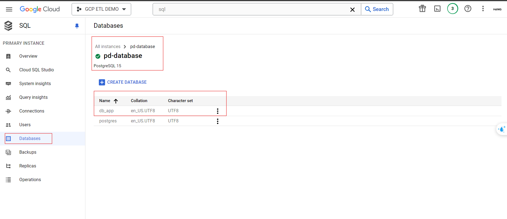

To create tables, we should make a new admin user instead default. Then, we access google sql studio, log in with the new admin user that created above. Copy script **google_sql/init_schema_db_script.sql** to google cloud studio and run to create table.

* Create user
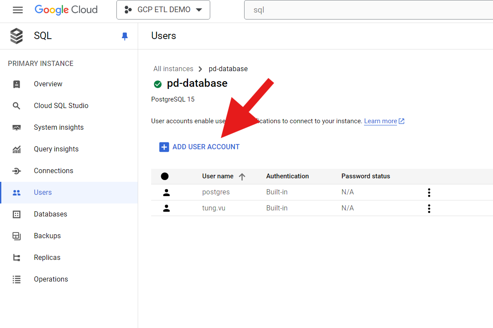
* Run script
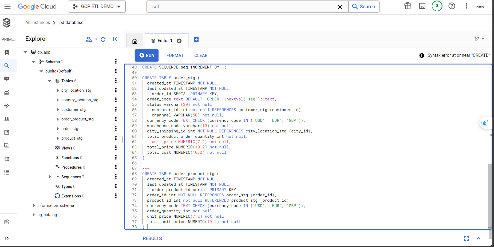

After run script, 6 tables will be created: city_location_stg; country_location_stg; customer_stg; order_stg; order_product_stg;product_stg

### Import data to tables
Setup a Bucket in Google Cloud Storage to upload files in **/dataset** folder. In this project, I created **dataset-db-1** bucket.
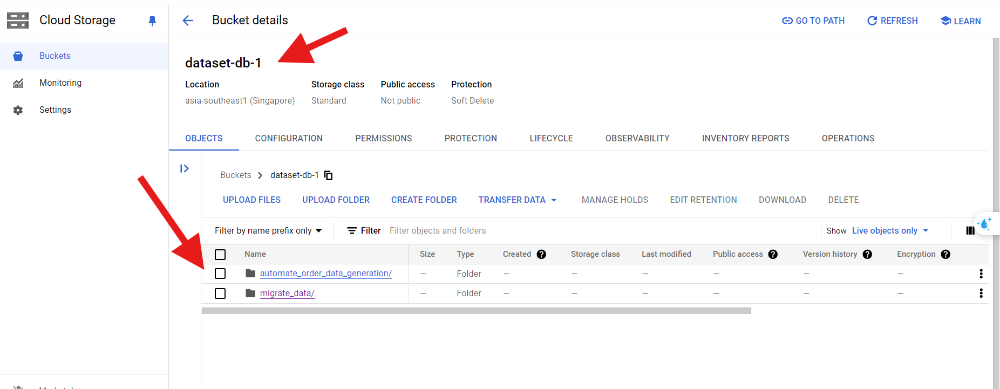
In Overview section on Cloud SQL, we select import.
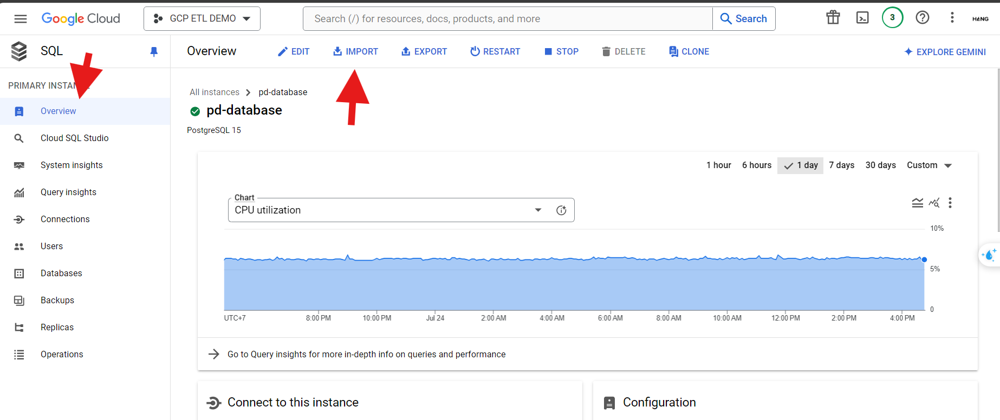 
In import data configuration, we choose csv file in **dataset-db-1** bucket, enter appropriate table name and database name.
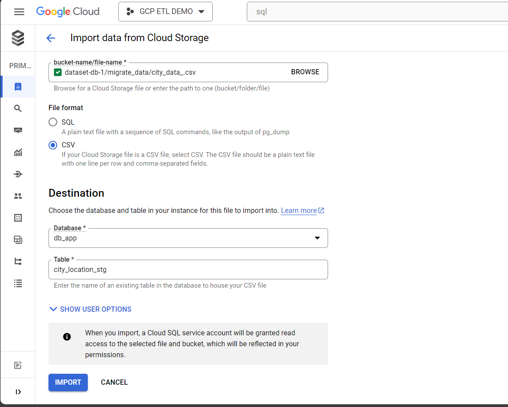

Table mapping between csv and table name database.
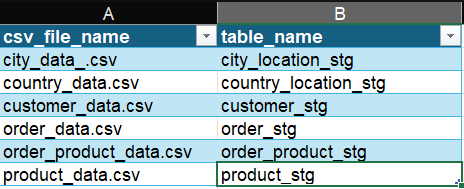 

## Data Generation
We schedule **data_generation_simulator/simulator_generator_data** using Windows Task Scheduler to automatically run script. Task scheduler will automatically call and execute the script to create new data for 2 tables: order_stg and order_product_stg

Instruction: [Schedule a Python script by Window Task Scheduler](https://community.esri.com/t5/python-documents/schedule-a-python-script-using-windows-task/ta-p/915861)

## Configuration Airflow pipeline
### Set up Airflow environment
#### Install Airflow by compose
Modify docker-compose.yaml. In line 52, we change to :
image: ${AIRFLOW_IMAGE_NAME:-apache/airflow:2.8.1}.

Run bash command to pulling airflow image and some related images.
``` bash
docker-compose up airflow-init
```

#### Extend Airflow with python packages:

Run bash command to extend airflow image with dependencies which used to build pipeline.
```bash
# Extend the Docker image
docker build . --tag extending_airflow
```

#### Run Airflow system
Modify docker-compose.yaml. In line 52, we change to :
image: ${AIRFLOW_IMAGE_NAME:-extending_airflow:latest}

Run bash command to start airflow system.

``` bash
docker-compose up
```

#### Make connection Airflow docker to GCP
Access http://localhost:8080/connection/list/. 
Add new connection with this configuration:
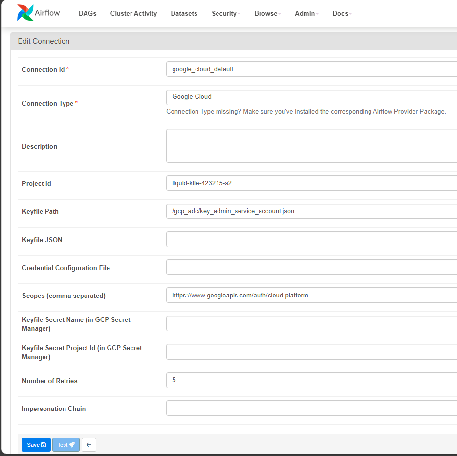

## Run pipeline
Access http://localhost:8080/home?tags=prj. This is list pipelines that I created in airflow/dags folder. I can run manually or read more details of specific pipeline.
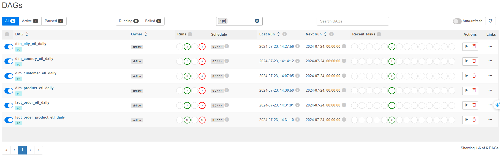 